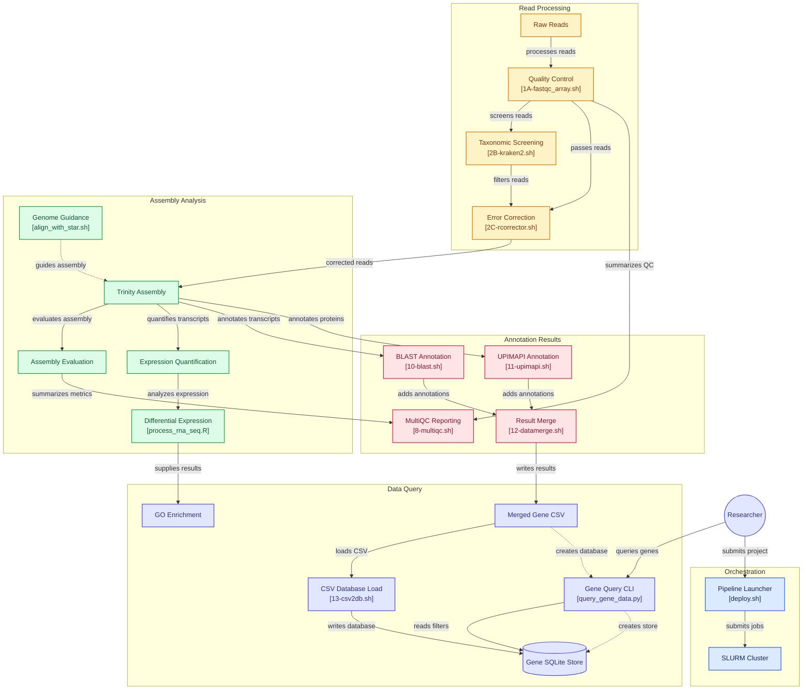

# transpiper

**Transpipeline v4** — Now supports both **de novo** and **genome-guided** transcriptome assembly, with differential gene expression and enrichment analysiS on SLURM-based HPC clusters.

For additional post-annotation data query and analysis, refer to:
👉 [https://github.com/krishnan-Rama/transpipeline\_containerised.git](https://github.com/krishnan-Rama/transpipeline_containerised.git)

---

## ✅ Installation

1. Clone the repository into your working directory on the HPC system:

```bash
git clone https://github.com/krishnan-Rama/transpiper.git
```
```bash
cd transpiper
```

2. Place your raw reads in the `raw_data/` folder.

3. Run the pipeline:

```bash
./deploy.sh -p <HPC_partition> -n <project_name> -r /path/to/reference.fasta -g /path/to/annotation.gtf
```

#### Run Options

#### Required

* `-p`: SLURM partition to submit jobs (e.g., `short`, `cpu`)
* `-n`: Project name or species identifier (e.g., `Hsap`, `mouse2025`)

#### Optional

* `-r`: Reference genome file (`.fasta`)
* `-g`: Genome annotation file (`.gtf`)

> If both `-r` and `-g` are provided and valid, the pipeline will run in **genome-guided** mode.
> Otherwise, it will default to **de novo** assembly.

---

## 🔁 Reusability

You can run multiple independent projects by cloning this repo into different directories and providing separate `raw_data/` and identifiers:

```bash
git clone https://github.com/krishnan-Rama/transpiper.git my_project_A
cd my_project_A
./deploy_pipeline.sh -p <partition> -n my_project_A
```

---

## 🗂 Output Structure

| Folder     | Description                                            |
| ---------- | ------------------------------------------------------ |
| `log/`     | SLURM `.out` and `.err` job logs                       |
| `workdir/` | Intermediate files for each processing stage           |
| `outdir/`  | Final pipeline outputs (assemblies, annotations, etc.) |
| `modules/` | All job submission scripts used by the pipeline        |

---

## ⚙️ Customizing SLURM Settings

Each pipeline step is modularized in `modules/*.sh`.
To change resources like memory, CPUs, or time limits, edit the respective scripts directly.

---

## 🧬 Workflow Overview

1. Quality control: `FastQC`, `fastp`, `Kraken2`
2. Error correction: `Rcorrector`
3. Transcriptome assembly: `Trinity` (de novo or genome-guided via `STAR`)
4. Evaluation: `BUSCO`, `TrinityStats`, `EviGene`
5. Quantification: `RSEM`, DE analysis
6. Functional annotation: `BLAST`, `UPIMAPI`
7. Summary report: `MultiQC`
8. Final merge and SQLite database creation
9. Gene Enrichment Analysis

---

## transpiper Architecture


